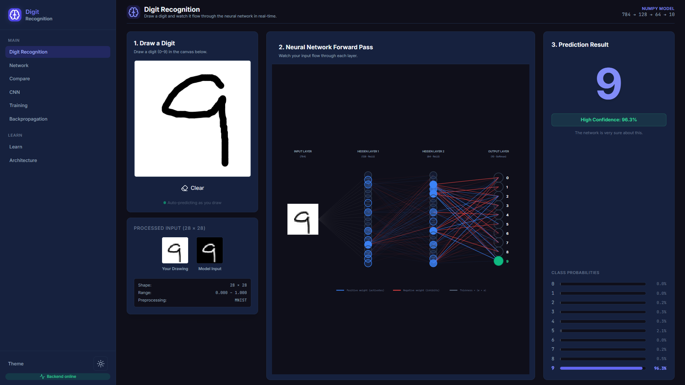

<div align="center">
  <h1>🧠 Handwritten Digit Recognition System</h1>
  <p><strong>An interactive, educational machine learning dashboard built from scratch to demystify neural networks.</strong></p>

  <p>
    
    
    
  </p>
</div>

<br />

Welcome to the **Interactive Neural Network Visualizer**. This project is not just a digit recognizer—it's an interactive laboratory designed to expose exactly how neural networks process information layer-by-layer, calculate gradients, and learn from data.

---

## 📸 Screenshots

<p align="center">
  
  
</p>
<p align="center">
  
  
</p>
<p align="center">
  
  
</p>
<p align="center">
  
  
</p>

---

## ✨ Key Features

- **🎨 Real-Time Digit Recognition**: Draw a digit (0-9) on the canvas and watch the model predict it instantly, complete with confidence scores and class probabilities.
- **🔍 Interactive Network Visualizer**: Watch the forward pass animate in real-time. See precisely which neurons activate and which edges (weights) contribute positively (blue) or negatively (red) to the prediction.
- **📐 Mathematical Backpropagation**: Step through the backpropagation algorithm. Click on individual weights to see their gradients and exactly how they update to reduce loss.
- **📊 Live Training Dashboard**: Train the custom NumPy model directly in your browser. Configure hyperparameters (Epochs, Batch Size, Learning Rate) and watch the loss and accuracy metrics update in real-time.
- **🧠 PyTorch CNN Comparison**: Compare the pure NumPy Feed-forward network against a production-grade PyTorch Convolutional Neural Network (CNN). Explore interactive heatmaps of the CNN's feature extraction layers.
- **📚 Educational Sandbox**: Dive into the "Learn" and "Architecture" pages to experiment with neural network structures and read interactive lessons tied directly to the visualizers.

## 📓 Jupyter ML Lab

The project includes professional Jupyter notebooks that explain the complete machine-learning pipeline behind the application. These notebooks serve as interactive documentation:

1. `01_MNIST_and_Preprocessing.ipynb`
2. `02_Neural_Network_From_Scratch.ipynb`
3. `03_Backpropagation_and_Training.ipynb`
4. `04_CNN_and_Feature_Maps.ipynb`
5. `05_Final_Digit_Recognition.ipynb`

**Note on Architecture:**
- These notebooks are **educational/documentation artifacts**.
- The production application remains **Python + FastAPI + React**.
- The notebooks **do not replace** the production backend or act as dependencies.
- They use the **exact same model concepts and architectures** present in the real application.

## 🛠️ Tech Stack

**Frontend:**
- **React (TypeScript)**: UI architecture and state management.
- **Vite**: Lightning-fast build tool.
- **Tailwind CSS**: Styling and responsive design.
- **Custom SVG & Canvas**: Highly optimized, custom-built visualizers for neural network structures.

**Backend:**
- **FastAPI**: High-performance REST API.
- **NumPy**: The core feed-forward neural network is built entirely from scratch using NumPy for maximum educational transparency.
- **PyTorch**: Used for the baseline Convolutional Neural Network.

## 🏗️ Architecture

### 1. NumPy Dense Network (Built from scratch)
- **Input**: 784 (28x28 flattened image)
- **Hidden Layer 1**: 128 neurons (ReLU activation)
- **Hidden Layer 2**: 64 neurons (ReLU activation)
- **Output Layer**: 10 neurons (Softmax activation)

### 2. PyTorch CNN (Baseline)
- **Input**: 1 × 28 × 28
- **Conv2D 1**: 1 → 8 (Kernel 3x3) + ReLU + MaxPool(2x2)
- **Conv2D 2**: 8 → 16 (Kernel 3x3) + ReLU + MaxPool(2x2)
- **Linear**: 784 → 10 (LogSoftmax)

## 🚀 Getting Started

Follow these instructions to run the project locally.

### Prerequisites
- Node.js (v18 or higher)
- Python (v3.10 or higher)

### 1. Backend Setup

Open a terminal and navigate to the backend directory:

```bash
cd backend

# Create a virtual environment
python -m venv venv

# Activate it
# Windows:
venv\Scripts\activate
# macOS/Linux:
source venv/bin/activate

# Install dependencies
pip install -r requirements.txt

# Start the FastAPI server
uvicorn app.main:app --reload
```
The backend API will run on `http://localhost:8000`.

### 2. Frontend Setup

Open a new terminal and navigate to the frontend directory:

```bash
cd frontend

# Install dependencies
npm install

# Start the Vite development server
npm run dev
```
The frontend will run on `http://localhost:5173`. Open this URL in your browser to interact with the application.

## 🧪 Testing

The project includes comprehensive test suites for the backend logic and frontend structure.

- **Backend tests:** `cd backend && python -m pytest tests/`
- **Frontend linter:** `cd frontend && npm run lint`
- **Frontend type-check:** `cd frontend && npx tsc --noEmit`

---
<div align="center">
  <i>Built to make the "black box" of Machine Learning visible, interactive, and understandable.</i>
</div>
